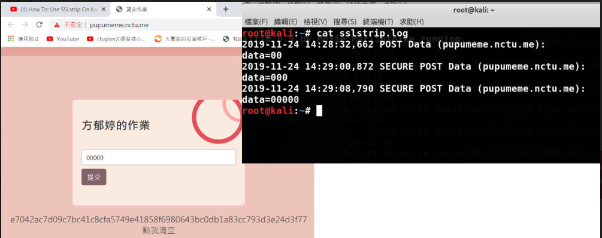

### 背景介紹  
網址旁邊如果有個鎖，就代表是用https傳輸，資料會加密   
   

但如果是用http傳的話，資料不會被加密，就可以使用SSLstrip攻擊，擷取你的傳輸資料   
   

### 目的
把所有書籤裡原本網址是http的改成https(如果該網站有支援的話)   

### 作法
遍歷所有書籤裡的url，如果是http就用https get看看，如果get成功就把url修改成https   

### 功能介紹  
可以把所有書籤裡的內容列出來，預設是列出使用http get的書籤   
   
有三種分類可選   
    

按這個按鈕就能將http轉為https   
   

### 驗證
將書籤的網址編輯成http   
   
成功出現在http的分類  

  
按下按鈕後  
  

顯示ok並且跑回https的分類  
  

網址也被成功改回https  
  
